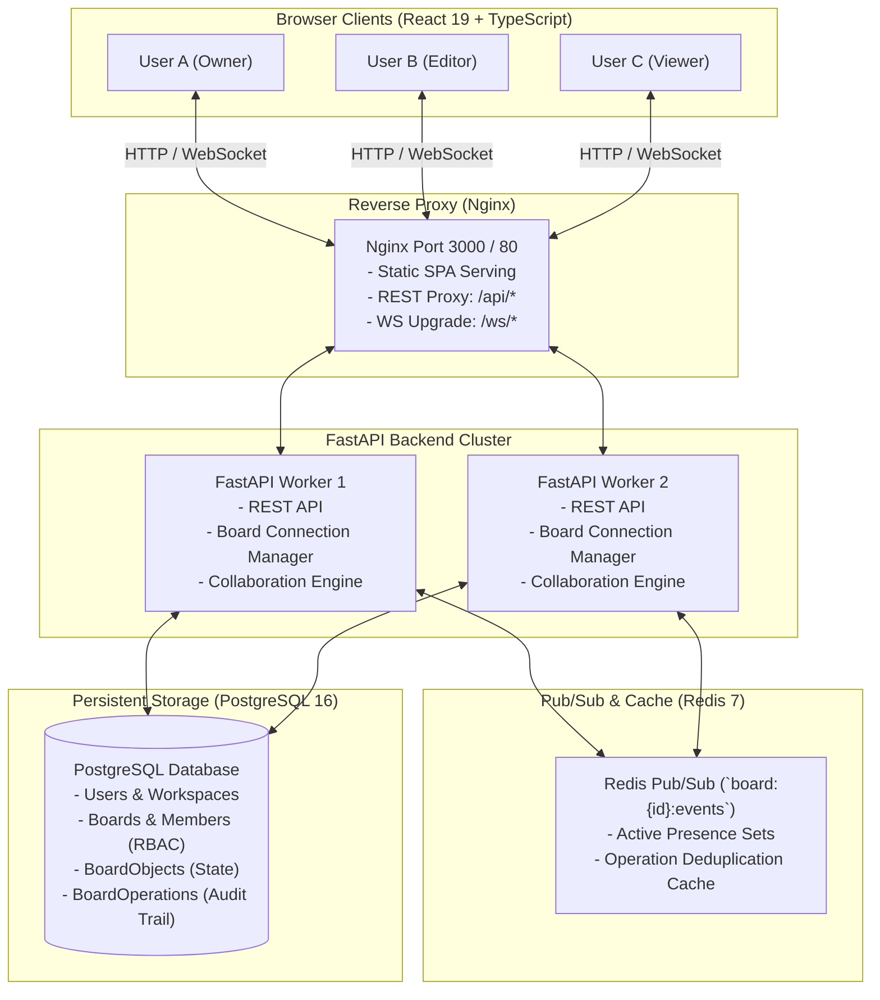
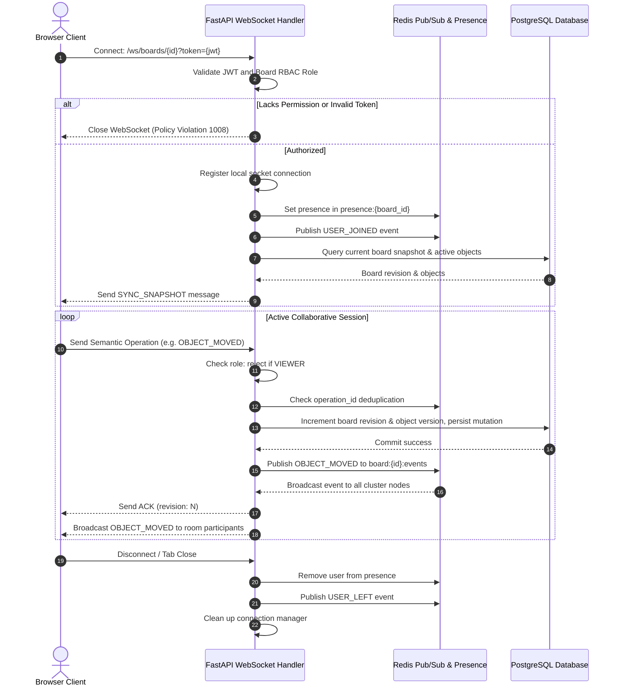

# Kanvaset — Technical Architecture & Engineering Design

This document details the architectural design, synchronization model, concurrency handling, and system topology of **Kanvaset**, a production-grade real-time collaborative workspace.

---

## 1. High-Level System Architecture

---

## 2. Real-Time Synchronization Lifecycle

---

## 3. Concurrency Model & Conflict Resolution

### Semantic Operations vs Whole-Board Diffs
Instead of serializing the entire board on every cursor flick or pixel drag, Kanvaset uses **semantic operation messages**:
- `OBJECT_CREATED`
- `OBJECT_MOVED`
- `OBJECT_RESIZED`
- `OBJECT_UPDATED`
- `OBJECT_DELETED`
- `CURSOR_MOVED` (ephemeral)

### Ordering and Versioning
1. **Monotonic Board Revision (`revision`)**:
   Every mutation operation increments the board's monotonic revision counter by 1 in an atomic database transaction. This provides an absolute total order for all board modifications.
2. **Object Versioning (`version`)**:
   Every `BoardObject` carries an integer `version` field starting at 1 and incremented upon each accepted mutation.
3. **Idempotency & Deduplication (`operation_id`)**:
   Every client operation generates a unique `operation_id` (`op_<timestamp>_<random>`). Before processing, the server checks Redis or memory LRU cache. Network retries or replayed messages are safely de-duplicated without re-applying state changes.
4. **Resynchronization (`SYNC_REQUEST`)**:
   If a client detects a revision gap (`client_revision < server_revision - 1`) or reconnects after temporary network loss, it issues a `SYNC_REQUEST`. The server responds with an authoritative `SYNC_SNAPSHOT`.

---

## 4. Role-Based Access Control (RBAC)

Kanvaset enforces authorization on every REST request and WebSocket connection:
- **`OWNER`**: Full administrative control. Can rename or delete board, invite members, and change permissions.
- **`EDITOR`**: Can create, move, resize, update, and delete objects on the board. Can view presence and cursors.
- **`VIEWER`**: Read-only access. Can view real-time changes, presence, and cursors. Any mutation operations sent by a viewer are rejected with an explicit `ERROR` envelope.

---

## 5. Horizontal Scaling with Redis

- **Local Broker vs Distributed Broker**:
  In single-node or testing environments, `backend/app/core/redis.py` automatically activates an asynchronous in-memory broker (`InMemoryEventBroker`).
- In multi-instance Docker or Kubernetes environments, Redis Pub/Sub coordinates events between all backend workers on channel `board:{board_id}:events`. When Worker 1 commits an operation, it publishes to Redis, and Worker 2 receives it and broadcasts to its locally connected WebSockets.
